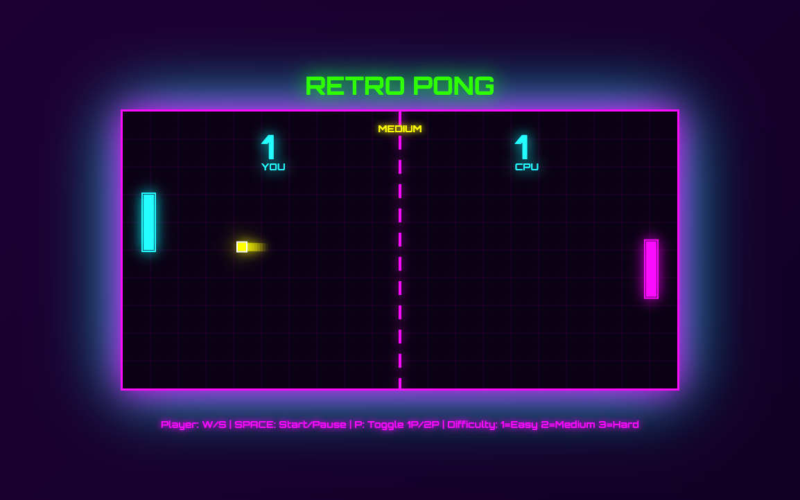

# 80s Retro Pong

A nostalgic, neon-styled Pong game with dynamic music, particle effects, and adaptive paddle mechanics. Built with vanilla JavaScript and HTML5 Canvas.

## Features

### Core Gameplay
- Classic Pong mechanics with a retro 80s aesthetic
- Neon glow effects and particle explosions
- Dynamic ball trails and visual feedback
- Paddle size changes based on scoring (winner's paddle grows, loser's shrinks)

### Game Modes
- **Single Player vs AI**: Three difficulty levels (Easy, Medium, Hard)
- **Two Player Mode**: Local multiplayer on the same keyboard

### Audio System
- **Dynamic Background Music**: Intensity changes based on game state
  - Bass line, drums, lead synth, and arpeggiator layers
  - Music tempo increases with game intensity
- **Retro Sound Effects**: 
  - Paddle hits
  - Wall bounces
  - Scoring
  - Game start/over sounds

### Visual Effects
- Neon color scheme with glowing elements
- Particle explosions on collisions
- Animated grid background
- Paddle size indicators (red tint for shrunk, green glow for grown)
- Ball trail effects

## How to Play

### Controls

**Player 1 (Left Paddle)**
- `W` - Move up
- `S` - Move down

**Player 2 (Right Paddle - Two Player Mode)**
- `↑` Arrow - Move up
- `↓` Arrow - Move down

**General Controls**
- `SPACE` - Start/Pause game
- `P` - Toggle between Single Player and Two Player mode
- `1` - Easy difficulty (Single Player mode)
- `2` - Medium difficulty (Single Player mode)
- `3` - Hard difficulty (Single Player mode)

### Game Rules
- First player to reach 5 points wins
- When you score, your paddle grows larger
- When you get scored on, your paddle shrinks
- Minimum paddle size: 30 pixels
- Maximum paddle size: 150 pixels
- Ball speed increases slightly with each paddle hit

## AI Difficulty Levels

- **Easy**: Slower reaction time, more errors, delayed responses
- **Medium**: Balanced gameplay, moderate challenge
- **Hard**: Fast reactions, minimal errors, quick responses

## Technical Details

### Technologies Used
- HTML5 Canvas for rendering
- Vanilla JavaScript (ES6+)
- Web Audio API for dynamic sound generation
- CSS3 for styling and animations

### Browser Compatibility
- Works in all modern browsers supporting HTML5 Canvas and Web Audio API
- Best experienced in Chrome, Firefox, Safari, or Edge

## Quick Start

1. Clone or download the repository
2. Open `index.html` in a web browser
3. Press SPACE to start playing

No installation or build process required!

## Files

- `index.html` - Main HTML file with game container and UI
- `game.js` - Complete game logic, physics, and audio system
- `README.md` - This file

## License

Open source - feel free to modify and share!